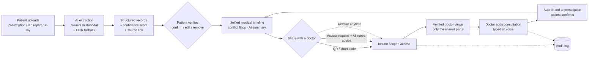
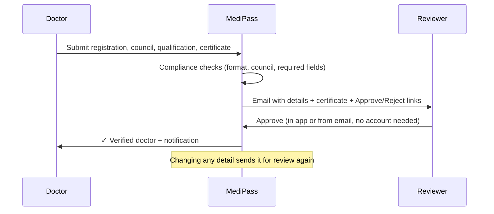
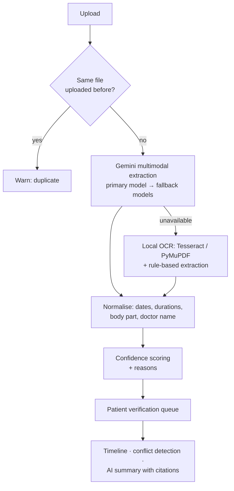

# MediPass — AI-Powered, Patient-Controlled Medical Timeline

> **One source-traceable medical history, shared on the patient's terms.**
> MediPass turns scattered prescriptions, lab reports and X-rays into a single,
> verified, chronological health timeline that the **patient owns** and shares
> only with **verified doctors**, only the parts they need, for only as long as
> they choose.

**Global Innovation Hackathon 2026 — Build for a Better Future (Bharat Academix)**

**Team:** `srijith11.2006` — **Srijith S** (Team Leader) · **Harsada K**

| | |
|---|---|
| 🌐 **Live app** | https://medipass-frontend-production.up.railway.app |
| ⚙️ **Live API** | https://medipass-ai-production.up.railway.app ([health](https://medipass-ai-production.up.railway.app/health) · [interactive API docs](https://medipass-ai-production.up.railway.app/docs)) |
| 💻 **Source code** | https://github.com/harsadaa-k/MediPass-AI |
| 🎬 **Demo walkthrough** | [`docs/DEMO_SCRIPT.md`](docs/DEMO_SCRIPT.md) (step by step, with sample documents) |
| ✅ **Test checklist** | [`docs/TEST_CHECKLIST.md`](docs/TEST_CHECKLIST.md) (every feature, live or local) |
| 📄 **Requirements** | [`docs/REQUIREMENTS.md`](docs/REQUIREMENTS.md) |

---

## 1. The problem

In India, a patient's medical history lives on **paper prescriptions, lab PDFs,
X-ray films and WhatsApp photos**, spread across clinics, hospitals and labs.

- A new doctor sees **no history**: past diagnoses, current medicines and allergies
  are lost or remembered wrongly, which leads to repeated tests and unsafe prescribing.
- Handwritten prescriptions are hard to read and impossible to search.
- Existing record apps either **store files without understanding them**, or give
  hospitals control of the data instead of the patient.
- Sharing is **all-or-nothing** (hand over the whole file) with no record of who saw what,
  and no way to know whether the "doctor" asking is really a registered doctor.

## 2. Our solution

MediPass is a web app (laptop and phone) with three roles: **Patient**, **Doctor** and
**Reviewer**.

1. The patient **uploads** a photo or PDF: prescription, lab report, X-ray (JPEG/PNG/DICOM).
2. **Multimodal AI** (Google Gemini) reads it, including handwriting, and extracts
   structured records: medicines with dose, timing and course; diagnoses; lab values;
   the body part in an X-ray. Every record gets a **confidence score**.
3. The patient **verifies** each record (**human-in-the-loop**). Only verified data joins
   the **unified medical timeline**, and every entry links back to its **source document**.
4. The patient shares with a doctor by **QR code / short code** or approves an **access
   request**, choosing **exactly what** (medications, labs, allergies, diagnoses or full
   history) and **for how long**. **AI recommends the minimum necessary** scope for that
   doctor's specialty.
5. Only **verified doctors** (registration, medical council, qualification, certificate,
   checked by a reviewer) can get access. They see only what was shared, add
   **consultation notes** (typed or by **voice dictation**), and get an **AI clinical summary**
   of the history with citations.
6. The doctor's note is **automatically linked to the prescription** it belongs to, and the
   patient confirms the link. Every access and change goes into an **audit log**, and the
   patient can **revoke** access at any time.

## 3. What makes MediPass different

| Differentiator | What it means in practice |
|---|---|
| **Patient-owned, consent-first** | Nothing is shared without the patient's consent; access is **scoped** (by record type), **time-limited** (auto-expires) and **revocable** instantly. |
| **Source-traceable by design** | Every record stores where it came from (uploaded document, AI extraction, doctor) and has **View source** to open the original file. No "mystery data". |
| **Honest, verifiable AI** | AI never writes straight into the history: **confidence scoring** with reasons (e.g. "dose missing"), low-confidence warnings, and **patient verification** before anything counts. Conflicts are **flagged, never silently overwritten**. |
| **Verified doctors only** | Doctors submit specialization, hospital, **NMC / State Medical Council** registration, education and a certificate; a reviewer approves in the app or **straight from an email**. Patients see a **✓ Verified doctor** badge. |
| **Minimum-necessary sharing, AI-assisted** | For each request, AI reads the doctor's whole verified profile and recommends only the scopes their specialty needs (e.g. a psychiatrist → medications, diagnoses, labs). |
| **Instant in-clinic sharing** | Patient shows a **single-use, 15-minute QR code** (or reads out an 8-character code like `K7Q4-M9TX`); the doctor scans or types it and the patient is added with the chosen scope, with no paperwork. |
| **Consultation ↔ prescription linking** | A doctor's consultation note is **auto-linked** to the matching prescription (same doctor, hospital, dates, medicines) and shown under it on the timeline; the patient confirms, and confirmed links are final. |
| **Works when AI doesn't** | If Gemini is down or out of quota: a **fallback model chain**, then **local OCR (Tesseract + PyMuPDF)** with rule-based extraction, a rule-based sharing recommendation and a factual summary. The app never breaks. |
| **Medical imaging aware** | X-rays and **DICOM** files: body part detected by AI and from DICOM tags, disagreements flagged, and the patient confirms the body part. |
| **Built for clinics** | Doctor's **Active Patients** board with automatic status (Critical / Follow-up required / New / Ongoing), follow-up dates, days under care; doctor notifications; treatment-course day counts. |

## 4. Complete workflow

### 4.1 End-to-end flow



### 4.2 Patient journey

1. **Sign up & verify email.** Register as a patient; a verification link arrives by email (resend, rate-limited).
2. **Upload a document.** Drag-and-drop, file picker or phone camera. Duplicate files are blocked (SHA-256 fingerprint).
3. **AI extraction.** Gemini reads the document (including handwriting) and returns medicines (dose, timing, duration), diagnoses, lab values, advice and the prescribing doctor/hospital. X-rays get the body part, view and a short description.
4. **Verify records.** Each record shows its confidence and why, plus **View source**. The patient confirms, edits or removes it. X-rays need the body part confirmed. Repeated entries are flagged as duplicates.
5. **Timeline.** Verified records in date order, grouped per prescription (Medicines / Diagnosis cards), with treatment courses (*day 4 of 10*, *completed*), conflict flags, sorting and filters, plus **Medications** and **Lab results** pages.
6. **Share.** **My QR code** (choose scope, access period and code validity), or approve a doctor's **Access request** using the AI recommendation.
7. **Stay in control.** Notifications when a doctor scans, adds a record or links a note; **Access requests** to revoke; an **Activity log** of every event.

### 4.3 Doctor journey

1. **Sign up as a doctor** and submit verification: specialization, hospital, registration number, medical council, qualification, education, affiliations, certificate.
2. **Reviewer approves** (see 4.4), and the doctor becomes **✓ Verified doctor**. Until then they can't access patients.
3. **Add patients**: scan the patient's QR, type their short code, or send an access request by email.
4. **View the patient**: only the shared record types, with an **AI clinical summary** that cites source records.
5. **Add a consultation**: typed or **voice dictation** (speech → AI-structured note). It appears on the patient's timeline immediately, attributed to the doctor.
6. **Active Patients board**: status, follow-ups due, last visit, access days left; search, filter and sort.
7. **Notifications**: patient approved, declined or revoked access; verification outcome.

### 4.4 Doctor verification (reviewer)



### 4.5 AI pipeline



### 4.6 Consent & access model

- **Scopes:** `medications`, `labs`, `allergies`, `diagnoses`, `full_history`, enforced on the server for the timeline, AI summary and records.
- **Time-limited:** every grant has an end date; expired access stops automatically.
- **QR codes:** 256-bit random token, only a hash stored, single use, 15 min – 24 h validity, one live code per patient. The typed short code has the same rules plus a wrong-code limit.
- **Revocable:** one click; the doctor loses access at once and is notified.
- **Audited:** requests, approvals, QR scans, records added, link events and removals are all logged.

## 5. Architecture & tech stack

```
 React 19 + Vite (responsive web app, phone & laptop)
        │  REST / JSON over HTTPS, JWT auth
        ▼
 FastAPI (Python 3.11) ── role-based access (patient / doctor / reviewer)
        ├── AI layer: Google Gemini (multimodal extraction, sharing advice,
        │            voice-note structuring, clinical summary) + fallback models
        ├── OCR fallback: Tesseract + PyMuPDF · DICOM: pydicom
        ├── Timeline intelligence: conflicts, courses, duplicates, linking, confidence
        ├── Email: Brevo HTTPS API (SMTP fallback)
        └── SQLAlchemy ── SQLite on a persistent volume (PostgreSQL-ready)
 Deployed on Railway (backend + frontend services)
```

| Layer | Technology |
|---|---|
| Frontend | React 19, Vite, React Router, jsQR (camera QR scan), react-qr-code, Web Speech API (voice) |
| Backend | FastAPI, SQLAlchemy, Pydantic, JWT (python-jose), bcrypt (passlib) |
| AI / ML | Google Gemini (multimodal LLM), Tesseract OCR, PyMuPDF, pydicom |
| Data | SQLite (swappable for PostgreSQL via one setting), uploaded files on a persistent volume |
| Hosting | Railway (two services, HTTPS), Brevo transactional email |

## 6. Security, privacy & responsible AI

- Passwords hashed with **bcrypt**; **JWT** sessions; authorization enforced **server-side** for every role.
- **Email verification** before login; password reset by email link.
- **Minimum-necessary** data sharing; scope enforced in every API that returns patient data.
- CORS limited to the app's own address; production mode disables demo accounts.
- QR and review tokens are **hashed or signed**, single-use and short-lived.
- AI output is always **labelled with confidence**, **verified by the patient**, and **traceable to its source**. MediPass **never makes clinical decisions**.
- Full **audit trail** visible to the patient.

## 7. Try it

### Live app
1. Open https://medipass-frontend-production.up.railway.app (a short intro plays, then the login page).
2. **Create an account** as a **Patient**, open the verification email (check Spam), log in, and upload a prescription photo.
3. To try the doctor side, create a second account as a **Doctor** (another email) and submit the verification form. A reviewer approves it, and then you can scan the patient's QR code.

### Run locally

Two terminals. First time only: copy `backend/.env.example` to `backend/.env` and add a Gemini API key.

```bash
# Terminal 1 — backend
cd backend
python -m venv venv
./venv/Scripts/python.exe -m pip install -r requirements.txt   # macOS/Linux: ./venv/bin/python
./venv/Scripts/python.exe -m uvicorn app.main:app --reload
```

```bash
# Terminal 2 — frontend
cd frontend
npm install
npm run dev
```

Open **http://localhost:5173** and log in with a seeded demo account:
`patient@medipass.demo` / `Demo@123` or `doctor@medipass.demo` / `Demo@123`.
For uploads without Gemini, install Tesseract (see [`backend/README.md`](backend/README.md)).

### Automated tests

```bash
cd backend
./venv/Scripts/python.exe test_smoke.py
```

Runs the whole journey (337 checks) against a throwaway database and prints
`ALL CHECKS PASSED`. Gemini is mocked by default; set `SMOKE_USE_REAL_GEMINI=1`
to use the live API.

## 8. Feature status

| Area | Status |
|---|---|
| Accounts, email verification (resend), password reset | ✅ |
| Upload (drag-drop / camera / file) → Gemini multimodal extraction with per-record confidence and reasons | ✅ |
| Fallback: model chain → local OCR (Tesseract + PyMuPDF) + rule-based extraction | ✅ |
| X-rays (JPEG/PNG/DICOM) with patient-confirmed body part (asked for images only) | ✅ |
| Patient verification queue; unified timeline with conflict flags, sorting (incl. date logged), filters; Medications / Lab results pages | ✅ |
| Treatment-course day counts and follow-up dates — [`docs/DAYS_AND_CONFIDENCE.md`](docs/DAYS_AND_CONFIDENCE.md) | ✅ |
| Duplicate protection (same file blocked, repeated entries flagged, cleanup script) — [`docs/DUPLICATES.md`](docs/DUPLICATES.md) | ✅ |
| Scoped, time-limited, revocable doctor access; access requests with AI minimum-necessary recommendation | ✅ |
| QR code and typed short code → patient added instantly — [`docs/QR_PATIENT_ADD.md`](docs/QR_PATIENT_ADD.md) | ✅ |
| Doctor verification with compliance checks, printable verification document, reviewer screen and approve-by-email — [`docs/DOCTOR_VERIFICATION.md`](docs/DOCTOR_VERIFICATION.md) | ✅ |
| Consultation notes (typed / voice dictation) auto-linked to the prescription, shown under it, patient-confirmed — [`docs/CONSULTATION_PRESCRIPTION_LINKS.md`](docs/CONSULTATION_PRESCRIPTION_LINKS.md) | ✅ |
| AI clinical summary with citations to source records | ✅ |
| Doctor's Active Patients board (Critical / Follow-up / New / Ongoing) — [`docs/ACTIVE_PATIENTS.md`](docs/ACTIVE_PATIENTS.md) | ✅ |
| Notifications (patients and doctors, Mark all read); audit / activity log | ✅ |
| Intro screen; phone-friendly layout (pinned swipeable menu) | ✅ |
| Deployed on Railway with persistent storage and Brevo email — [`docs/DEPLOYMENT.md`](docs/DEPLOYMENT.md) | ✅ |

## 9. Roadmap

- **ABDM / ABHA** integration: link records to the patient's ABHA ID and exchange them through the Health Information Exchange.
- Hospital and lab accounts that push reports directly into the timeline.
- Multilingual extraction (Hindi, Tamil and other Indian languages) and multilingual voice notes.
- Caregiver / family access and emergency access cards.
- Medicine reminders from the extracted treatment courses; drug-interaction alerts for doctors.
- PostgreSQL, encryption at rest and automated verification against the NMC register.

## 10. Team & acknowledgements

| Member | Role |
|---|---|
| **Srijith S** | Team Leader |
| **Harsada K** | Team Member |

**AI assistance disclosure:** parts of this project's code, tests and documentation were written with the help of an AI coding assistant (Claude by Anthropic). The team defined the idea, requirements and features, directed and reviewed the work, and tested the app end to end. Separately, MediPass itself uses Google Gemini at runtime for document extraction, sharing recommendations, voice-note structuring and clinical summaries.

## 11. Documentation

| Document | Contents |
|---|---|
| [`docs/REQUIREMENTS.md`](docs/REQUIREMENTS.md) | Functional and non-functional requirements, data model |
| [`docs/DEMO_SCRIPT.md`](docs/DEMO_SCRIPT.md) | Step-by-step demo of every feature, with sample documents |
| [`docs/TEST_CHECKLIST.md`](docs/TEST_CHECKLIST.md) | Full manual test checklist (laptop and phone) |
| [`docs/DEPLOYMENT.md`](docs/DEPLOYMENT.md) | Railway deployment, environment variables, email setup |
| [`docs/DOCTOR_VERIFICATION.md`](docs/DOCTOR_VERIFICATION.md) | Verification fields, compliance checks, reviewer workflow |
| [`docs/QR_PATIENT_ADD.md`](docs/QR_PATIENT_ADD.md) | QR / short-code sharing and how it's secured |
| [`docs/CONSULTATION_PRESCRIPTION_LINKS.md`](docs/CONSULTATION_PRESCRIPTION_LINKS.md) | How notes are matched to prescriptions |
| [`docs/ACTIVE_PATIENTS.md`](docs/ACTIVE_PATIENTS.md) | Doctor's patient board and statuses |
| [`docs/DAYS_AND_CONFIDENCE.md`](docs/DAYS_AND_CONFIDENCE.md) | Treatment-course days and confidence scoring |
| [`docs/DUPLICATES.md`](docs/DUPLICATES.md) | Duplicate detection and cleanup |
| [`backend/README.md`](backend/README.md) | Backend setup, Tesseract, project layout |

---

*MediPass: your medical history, in one trusted timeline.*
